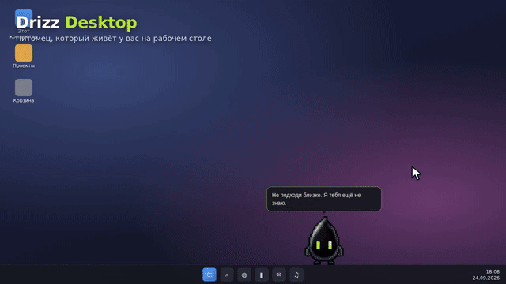

# Drizz Desktop 0.1



Промо-ролик: [docs/promo/drizz-desktop-promo.mp4](docs/promo/drizz-desktop-promo.mp4) (записан на демо-«рабочем столе» в браузере, `tools/demo/`).

**Текущий статус (2026-09-21):** исправлена невидимость персонажа в release-сборке (CSP блокировал загрузку атласов), добавлена адаптация к масштабу Windows, манифест Per-Monitor V2 и поддержка Windows 10. Нативные проверки переноса на окно, следования за окном, падения и скрытия в полном экране пройдены; список выполненных и невыполненных проверок — `TEST_REPORT.md`. Архив исходников не содержит папку `release`; EXE и установщик получаются командой сборки ниже.

Отдельное приложение для Windows 10 22H2 (10.0.19045) и Windows 11, x64. Другие архитектуры не собираются. AniBlaze и TimePet не изменяются.
Основа — предоставленный WindowPet: Tauri 1 / React 18 / Phaser 3. На рабочем столе только персонаж и временные реплики, настройки и разговор открываются по запросу. По умолчанию выбран Drizz. Мат не цензурируется.

**2026-09-22:** питомец стал активнее (реакции на клики, прокрутку и печать в любых программах, бег к месту клика, реплики «просто так», беготня в 2 раза чаще), появились вкладки «Статус», «Магазин» (прокачка по модели VPet) и «Статистика» (время по программам; питомец иногда сообщает лидера дня).

**2026-09-24 — живой питомец.** Исправлены переход между мониторами (раньше край соседнего экрана был стеной) и перетаскивание без анимации (теперь питомец висит в руке как маятник, дрыгает лапами, от тряски у него кружится голова, после сильного броска он кувыркается). Добавлены: характеры (Drizz — наглый, Claude — ворчливый философ, Nezuko — энергичная и ревнивая, Eigenblob — туповатый, Aqua — меланхолик) как поведение, а не отдельные наборы фраз; игры с курсором (трогает, толкает, ловит, а обиженный — охотится, бьёт лапой и прыгает сверху, каждый персонаж по-своему); память о событиях и долгие отношения (от «чужого» до «лучшего друга»), обиды в углу, табличка «Я это запомнил», упрямое возвращение на окно, записки, прятки, подарки, мелкое воровство, лазание по окнам, укачивание, места для сна, ночной сон, праздники и день рождения, погода по согласию, команды, мини-игры, гардероб по уровням, достижения, роли «охранник» и «уборщик Temp», синтезированное бормотание и звуки действий, танцы под музыку. Панель настроек пересобрана на Radix Themes и Lucide. Подробности — ниже, проверки — `TEST_REPORT.md`, промт для продолжения работы — `docs/PROMPT.md`.

## Запуск

После `npm run package` EXE находится в `src-tauri/target/release`, а установщик — в `src-tauri/target/release/bundle/nsis`. Для запуска достаточно `Drizz Desktop.exe`; нужен системный Microsoft Edge WebView2 Runtime. Установщик проверяет его наличие. Сборка не подписана сертификатом разработчика.

- Перетащите персонажа левой кнопкой. Можно аккуратно бросить; он упадёт на рабочую область или доступный верхний край окна.
- Короткий клик — реакция, частые клики — другая реплика. Правый клик — карточка рядом с питомцем (уровень, деньги, ступень отношений, настроение, сытость, вода, бодрость, здоровье, текущая смена; кнопки «Покормить», «Поиграть», «Панель»).
- Значок в трее: позвать, поговорить, режимы, «Вернуть персонажа на экран» (ставит питомца на доступный монитор, остальные настройки не трогает), скрыть и настоящий выход.
- `Ctrl+Alt+D` — позвать к курсору; `Ctrl+Alt+C` — открыть разговор. Сочетания регистрируются напрямую через `RegisterHotKey` в потоке WinEvent-хуков (`native.rs`); если сочетание занято другой программой, оно остаётся недоступным, а действия доступны из трея (результат регистрации виден в диагностике).
- Закрытие окна настроек не завершает питомца. «Выйти» в трее завершает приложение.
- Режим «Тихий» отключает самостоятельные реплики; «Не мешать» отправляет в угол без текста. Закрепление отключает самостоятельное движение, но оставляет перетаскивание.
- Изменения настроек применяются кнопкой «Сохранить». Автозапуск выключен по умолчанию.

## Масштаб Windows и DPI

Приложение объявлено Per-Monitor V2 в манифесте (`src-tauri/build.rs`), поэтому все координаты Win32 — физические пиксели. Окно персонажа всегда 360×340 логических пикселей; WebView2 сообщает `devicePixelRatio`, и холст Phaser рендерится в физическом разрешении (`src/dpi.ts`, камера сцены с zoom = DPR). Регион окна и его размер считаются по тому же DPR, поэтому силуэт, область захвата мышью и реплики совпадают при 100–300 %. Ручной «Размер» — логическая величина поверх системного масштаба; по умолчанию 76 (около 100 физических пикселей при 125 %), диапазон 56–176. «Сглаживание» (по умолчанию включено) рисует уменьшенный атлас с фильтрацией высокого качества (`imageSmoothingQuality = "high"`, LINEAR-фильтр текстуры); выключение даёт чёткие пиксели (NEAREST). При смене масштаба или переносе на монитор с другим DPI Windows присылает WM_DPICHANGED, tao подгоняет окно, сцена перестраивает холст на следующем кадре. Физика (`movement.ts`) использует масштаб монитора под ногами, который в установившемся состоянии равен DPR.

## Диагностика

Переключатель «Диагностика в файл» во вкладке «Доступ» или запуск с `--diag`. Пишется `%LOCALAPPDATA%DrizzDesktopdiagnostic.log` (ротация при 1 МБ): выбранный атлас и результат загрузки, количество кадров, смена состояния и кадра, размер/позиция окна, DPR и назначенный Windows DPI, причина скрытия, мониторы, начало перетаскивания. Одинаковые значения не пишутся повторно; по умолчанию выключено. Если атлас не загрузился, вместо персонажа показывается текст с причиной, а не пустое место.

## Что подключено

Ходьба с направленными кадрами, разгон и торможение, падение/приземление, следование за окном-опорой, потеря опоры при сворачивании, перетаскивание, моргание, взгляд, отдых, сон и короткие реакции. Размер меняется без обрезания атласа. Прозрачные области вне силуэта исключаются из native window region и пропускают клики. Окно персонажа имеет `WS_EX_NOACTIVATE`.

События самой Windows (`env.rs` → `Desktop` в снимке, тумблеры «События Windows» и «Звук системы» во вкладке «Доступ»): громкость вверх/вниз, выключение и включение звука, слишком громко, появление и пропадание звука в системе, копирование в буфер (только номер изменения, не содержимое), очередь копирований подряд, PrintScreen, Caps Lock, смена светлой/тёмной темы, память под 90%, меньше 8% свободного места на системном диске, открытие и закрытие окон, больше 14 окон сразу, возвращение из сна. Ни заголовков окон, ни текста буфера, ни звука — только числа и флаги.

Локальные события: первое приветствие за день, возврат после бездействия, отдых/сон, позднее время, редактор, игра из пользовательского списка, выход из неё и возврат в редактор, долгая сессия, частое переключение окон, мессенджер, освобождённый рабочий стол, системное медиа play/pause/resume, повтор трека по идентификатору и позиции, длительная высокая нагрузка CPU, состояние подключения Windows, батарея при её наличии, питание и появление монитора. Точных данных о содержимом окон нет и реплики их не выдумывают.

Для неизвестной игры укажите имя её `.exe` во вкладке «Доступ». Полноэкранное окно по умолчанию скрывает питомца независимо от классификации. Исключения отображаются уменьшенными. Процессы игр не изменяются, внедрения нет.

Медиасобытия доступны только от приложений, публикующих Windows SMTC. Если сессия отсутствует, состояние неизвестно: приложение не выдумывает музыку, паузу или конец серии. Низкая активность клавиатуры не считается уходом, когда играет медиа, активен контроллер либо включена известная игра/полный экран.

У каждой реакции свой приоритет, срок жизни и cooldown. Очереди старых реплик нет. Обычные реплики по умолчанию не чаще раза в 3 минуты; недавние фразы не повторяются. После временной реакции используется текущее базовое состояние. Claude/Aqua двигаются и говорят реже, Nezuko активнее; Drizz — основной дерзкий вариант.

## Разговор и память

Без ключа используются честно обозначенные готовые короткие ответы. Обычные реакции, движение и события не требуют сети. «Запомни: …» сохраняет только прямо указанный факт; имя и факты можно просматривать, редактировать и удалять в «Памяти». Подробного журнала активности нет. Разговор хранится только до закрытия его окна.

Свободный разговор: включить модель во вкладке «Доступ», ввести **свой** OpenRouter-ключ и сохранить. Модель по умолчанию — `google/gemini-3.1-flash-lite`; идентификатор можно изменить. Один запрос только на явно отправленное сообщение, максимум 180 токенов ответа и 20 секунд ожидания. Передаются сообщение, до 6 предыдущих сообщений, обращение и явно сохранённые факты. Опциональный контекст — только персонаж и режим. Ответы модели — текст, не команды. Поздний ответ после смены вкладки/персонажа/режима отбрасывается.

Ключ шифруется Windows DPAPI для текущего пользователя и не попадает в исходники или журналы. Данные: `%LOCALAPPDATA%\DrizzDesktop\state.json`, актуальная резервная копия и зашифрованный `credential.bin`. Удалённый факт не остаётся в резервной копии. Автоматическое сохранение положения не может вернуть удалённый факт.

## Подключение реальных событий других программ

Сначала включите «События от программ» и сохраните. Сервер слушает только `127.0.0.1:49753`, принимает `POST /event` с локальным Bearer-токеном. Запросы без токена, из веб-страниц с Origin, неизвестные типы и слишком большие данные отклоняются. Повтор ID в течение 10 минут не вызывает новую реакцию. Никакие команды из запроса не исполняются. Выключение настройки закрывает порт.

Готовый отправитель читает токен из локальных настроек:

```powershell
.\Send-DrizzEvent.ps1 -Kind build-success -Title "Мой проект" -Id "build-42"
.\Send-DrizzEvent.ps1 -Kind render-done -Id "render-42"
```

Типы: `build-success`, `build-failed`, `render-done`, `download-done`, `episode-ended`.
Вызов нужно подключать **после реального события** в конкретной программе или скрипте сборки. AniBlaze автоматически не подключён и не изменён. Конец серии не трактуется как конец сезона. Браузерные загрузки и результаты игры не угадываются по имени окна.

## Сборка и проверки

Нужны Node.js, Rust stable MSVC, C++ Build Tools и WebView2.

```powershell
npm ci
npm test
npm run build
cargo test --release --manifest-path src-tauri/Cargo.toml
npm run package
```

Инструменты проверки (без Playwright): `node tools/cdp-probe.cjs --exe <EXE> [--panel] [--recenter] [--exit]` запускает EXE с отдельным профилем и портом отладки WebView2, печатает ошибки консоли, размер холста и DPR, снимок страницы и файл диагностики; `tools/desktop-shot.ps1` снимает реальные пиксели окна питомца с рабочего стола (визуальная проверка, а не только компиляция); `tools/native-window-check.ps1` и `tools/native-drag-check.ps1` — стиль окна, регион, реальное перетаскивание на окно, следование, падение, полный экран; `tools/dpi-switch-check.ps1` временно меняет масштаб основного монитора (150 %, 100 %) и возвращает его; `tools/legacy-profile.cjs` готовит профиль старой версии для проверки обновления. `tools/preview-check.cjs`, `tools/native-smoke.cjs` и `tools/demo/check.cjs` (живая проверка на имитации рабочего стола: панель смены, тревога во время работы, карточка, прыжок на окно, удар по курсору над головой, «тоже посмотрю») требуют Playwright в NODE_PATH. Режим отладки WebView2 не включён в обычный запуск. Результаты проверок и ограничения — в `TEST_REPORT.md`.

## Совместимость с Windows

Минимум: Windows 10 22H2 (10.0.19045) x64; Windows 11 x64. Требуется Microsoft Edge WebView2 Runtime (установщик предлагает его загрузить). Права администратора не нужны, режим совместимости не требуется. Используемые API и их минимальные версии: `SetWindowRgn`, `DwmGetWindowAttribute`, `SetWinEventHook`, `GetLastInputInfo`, `GetDpiForMonitor` (8.1), `GetDpiForWindow`, `SetThreadDpiAwarenessContext` (10 1607), Per-Monitor V2 (10 1703), `XInputGetState` (xinput1_4, 8), DPAPI, SMTC `GlobalSystemMediaTransportControlsSessionManager` (10 1809; при недоступности медиасобытия просто отсутствуют, остальное работает), `NetworkInformation` (8). Rust std требует Windows 10+. На Windows 10 сборка проверена только по коду и требованиям зависимостей — реальный запуск см. `TEST_REPORT.md`.

## Активность, прокачка и статистика

- Низкоуровневые хуки `WH_MOUSE_LL` / `WH_KEYBOARD_LL` в `native.rs` только считают клики, прокрутку и нажатия (коды клавиш не читаются) и запоминают точку последнего клика. Клики по самому питомцу не считаются. Выключается тумблером «Клики и печать в других программах».
- `director.ts` по счётчикам выдаёт события `typing`, `typingLong`, `afterBurst`, `clicking`, `scrolling`, `rightClick`, `glance`, `curious` (бег к далёкому клику). Реплики «просто так» — `chatter`, интервал = «не чаще N минут» × 0.6…1.3. Общий порог «не чаще N минут» теперь действует только на фоновые реплики; реакции на действия ограничены своим cooldown и паузой 20 с.
- `usage.rs` пишет секунды активного окна по имени .exe в `%LOCALAPPDATA%\DrizzDesktop\usage.json` (90 дней, запись раз в минуту и при выходе). Вкладка «Статистика»; события `stats` (раз в 90–150 мин) и `statsDay` (после 21:00).
- Прокачка (`upgrades` в `game.ts`): 8 навыков по 5 уровней (желудок, верблюд, выносливость, наглость, мозги, здоровье, пофигизм, деловая хватка), цена ×1.75 за уровень; множители применяются в `minute()` — расход еды/воды, восстановление бодрости, деньги, опыт, регенерация здоровья, скорость падения настроения и оплата работы. Вкладка «Прокачка», команда `buy_upgrade` → событие `upgrade`.
- Работа (`jobs` в `game.ts`): 5 смен от 5 до 30 минут, открываются по уровню (1/3/5/8/12). Смена тратит бодрость, еду и воду, идёт в реальном времени и продолжается, даже когда вас нет; по окончании — деньги и опыт. Вкладка «Работа», команда `start_job` → событие `job`; выплата в `workPayout`.
- Клик по питомцу показывает строку состояния (уровень, проценты до следующего, деньги, что болит) прямо в облачке; правый клик открывает панель на вкладке «Статус».
- Звуки (`sound.ts`, `public/sfx/`, Kenney CC0): клик, тык, реплика, еда, питьё, монета, уровень, прокачка, отказ, смена, зов, падение, сон, пробуждение. Тумблер «Звуки» и громкость — во вкладке «Питомец». WebView2 запускается с `--autoplay-policy=no-user-gesture-required`, иначе первый звук ждал бы клика внутри окна.
- При самом первом запуске питомец достаёт карточку с приветствием (флаг `cardShown` в памяти, показывается один раз).
- `game.ts` — модель VPet: `level = floor(sqrt(exp)/10)+1`, до апа `(level·10)²`, статы настроение/бодрость/сытость/вода/здоровье/симпатия, тик раз в минуту, магазин из 27 предметов (`public/shop/`, см. `THIRD_PARTY.md`). Состояние в `state.json` → `game`, владелец — окно питомца (`save_game`), покупка через `buy_item` → событие `buy`.

## Живой питомец (0.2)

- **Мониторы.** Питомец ходит и бросается через стык соседних мониторов, спрыгивает на более низкий экран и запрыгивает на более высокий (`movement.ts`: `neighbor`, `span`, `reachable`). Вертикальная панель задач на стыке — стена. На недостижимый монитор (сверху, с зазором) он «переходит» сразу. Окно-оверлей может заходить на соседний экран, чтобы питомец не обрезался на стыке.
- **В руке.** Маятник вокруг точки захвата (`Movement.hang`), кадры «вис», «дрыгает лапами», «трясут». Тряска копит головокружение: звёздочки над головой, шатание, реплика. Сильный бросок — кувырок в полёте. Регион окна поворачивается вместе со спрайтом (`pose.ts`).
- **Курсор** (`cursorplay.ts`, тумблеры «Игры с курсором» и «Может толкать курсор»). Курсор, долго стоящий рядом, питомец сначала трогает, потом толкает. Пролетающий мимо головы — пытается поймать. Обиженный (обида выше порога характера, броски или тычки за последние 15 минут) охотится: подходит, бьёт лапой, может прыгнуть сверху и «придавить», потом садится рядом и следит. Настоящий курсор сдвигается на 30–90 пикселей плавным толчком (`chores.rs::nudge`) — никогда при зажатой кнопке мыши. Удачная месть снижает обиду.
- **Память** (`chronicle.ts`, хранится в прогрессе): счётчики и отметки времени (броски, перетаскивания, кормления, пробуждения, тревоги…), отношение к программам, любимые места, где чаще приземляется, чьи окна пропадают под ним, серия дней, достижения, стикеры, запасы. «Опять кидать будешь, садист?», утренняя гримаса после частых побуждений, демонстративный уход на окно программы, которая его «роняет».
- **Отношения** — пять ступеней по симпатии, дням вместе и череде обид. Реплика выбирается по настроению (`click@angry`), затем по ступени (`click~close`); на высоких ступенях — личные шутки с вашим именем и сохранёнными фактами.
- **Сам по себе**: бормочет (пиксели, песенки, вздохи), выбирает место для сна (угол, любимое место, окно), ночью спит и ворчит на часы, утром потягивается, обедает, танцует под музыку, в наушниках при музыке, с фонариком ночью, под зонтом в дождь (если включена погода: Open-Meteo по вашим координатам), наряжается на праздники. Иногда уходит, оставив записку («Ушёл за пивом.»; быстрый клик по ней — «Я же написал.»), приносит подарки, таскает мелочь в угол (вернёт, если погладить), лазает по краю окна.
- **Команды** в «Разговоре»: сядь, иди сюда, спать, прыгни, танцуй, отвали (уйдёт за край и выглянет через минуту), играть, охраняй, уберись. Слушается по настроению и отношениям.
- **Игры**: камень-ножницы-бумага и «в какой лапе» — кнопками в облачке, кликер на 10 секунд, «поймай курсор».
- **Прогресс**: навыки «Ловкость» (прыжки, лазание, меньше промахов) и «Бдительность» (подробнее объясняет процессы, дольше охраняет), гардероб по уровням (кепка, бантик, цилиндр, корона, нимб, аура), 24 достижения с наградами, роль «охранник» (сообщает о тихих фоновых запусках) и «уборщик» (считает файлы старше недели в %TEMP% (как «Очистка диска») и удаляет их только после «Почистить»).
- **Кормление**: кнопкой, перетаскиванием иконки из панели на питомца, из запасов или кнопкой «Покормить» прямо в облачке с жалобой на голод. Голод, жажда, болезнь видны значками над головой.
- **Звук**: бормотание в стиле Animal Crossing под каждую реплику (у каждого персонажа своя высота и тембр), шаги, прыжок, приземление, храп, хруст, удар лапой — синтез WebAudio, без файлов.
- **Смена** (`workhud.ts`). Пока питомец работает, над ним панель статуса: спиннер из cli-spinners под профессию, название, оставшееся время, полоса прогресса, заработанное и бегущая строка «статистики» (раздано флаеров, зрители и донаты, найденные баги, хэшрейт и температура, обходы серверной). На работе он не охотится на курсор, не уходит, не пугается и не болтает: проходят только важные сообщения (тревоги трассировки, автозагрузка, батарея, память, диск, сеть, болезнь, пики нагрузки, конец смены, уровень, достижения) — облачком поверх панели.
- **Реплики не перебивают друг друга.** У каждой реплики есть время на чтение (от длины текста); пока оно не вышло, фразу может заменить только событие не ниже её приоритета, а фоновые реплики ждут очереди.
- **Окна.** В свободное время питомец запрыгивает на окно, до которого достаёт прыжком (ловкость увеличивает высоту), и сидит на нём.
- **Курсор.** Обиженный питомец, увидев курсор, прыгает на него, если достаёт, и бьёт; если курсор выше прыжка — встаёт под ним, злится, подпрыгивает с замахом и садится следить. Промах — не конец охоты: он пробует ещё.
- **«А ну-ка я тоже посмотрю».** Любопытный идёт к месту, куда вы кликнули, и там что-то делает: запрыгивает на это окно, бьёт лапой по точке или долго её разглядывает с комментарием.
- **Исправлено попутно**: ответ на клик больше не затирается строкой состояния (она идёт второй строкой), время с закрытым приложением считается «один», а не «рядом с вами» (раньше за ночь питомец голодал и болел), завершённая без вас смена оплачивается, реплики о голоде не пропадают из-за общего лимита, ночные и вечерние реплики не повторяются после перезапуска, тики и выплаты идут и при скрытом питомце, выход из трея сохраняет прогресс, отравленный мьютекс в Rust больше не валит все команды.

Модули: `native.rs` — геометрия/WinEvents/input idle/хуки ввода; `env.rs` — громкость, звук, буфер, тема, память, диск, число окон; `usage.rs` — время по программам; `game.ts` — прокачка; `apps.ts` — имена программ; `observe.rs` — системные сигналы/медиа; `director.ts` — реакции; `movement.ts` — движение; `animation.ts` — атлас; `PetScene.ts` — сцена; `dpi.ts` — логический/физический размер холста; `diag.ts` — диагностика; `dialogue.ts` — реплики; `storage.rs` — сохранение, DPAPI, файл диагностики; `src/panel/` — окно настроек (Radix Themes); `cursorplay.ts` — курсор; `antics.ts` — долгие занятия; `chronicle.ts` — память и достижения; `character.ts` — характеры; `calendar.ts` — время суток и даты; `voice.ts` — синтез звуков; `pose.ts`/`effects.ts`/`balloon.ts`/`props.ts` — отрисовка; `chores.rs` — толчок курсора, Temp, погода; `workhud.ts` — панель смены; `quickcard.ts` — карточка по правому клику; `integration.rs` — локальные события.

## Документация, использованная при реализации

- [Microsoft: SetWinEventHook](https://learn.microsoft.com/en-us/windows/win32/api/winuser/nf-winuser-setwineventhook)
- [Microsoft: IAudioEndpointVolume](https://learn.microsoft.com/en-us/windows/win32/api/endpointvolume/nn-endpointvolume-iaudioendpointvolume)
- [Microsoft: IAudioMeterInformation](https://learn.microsoft.com/en-us/windows/win32/api/endpointvolume/nn-endpointvolume-iaudiometerinformation)
- [Microsoft: GetClipboardSequenceNumber](https://learn.microsoft.com/en-us/windows/win32/api/winuser/nf-winuser-getclipboardsequencenumber)
- [Microsoft: GetLastInputInfo](https://learn.microsoft.com/en-us/windows/win32/api/winuser/nf-winuser-getlastinputinfo)
- [Microsoft: системные медиасессии](https://learn.microsoft.com/en-us/uwp/api/windows.media.control.globalsystemmediatransportcontrolssessionmanager)
- [Microsoft: SetWindowRgn](https://learn.microsoft.com/en-us/windows/win32/api/winuser/nf-winuser-setwindowrgn)
- [Tauri 1: Windows prerequisites](https://v1.tauri.app/v1/guides/getting-started/prerequisites/)
- [Tauri 1: security.csp](https://v1.tauri.app/v1/api/config/#securityconfig.csp) — `connect-src` должен разрешать `'self'`, иначе XHR к `https://tauri.localhost` блокируется
- [Phaser: LoaderConfig.imageLoadType](https://docs.phaser.io/api-documentation/typedef/types-core#loaderconfig) и [ScaleManager zoom](https://docs.phaser.io/api-documentation/class/scale-scalemanager)
- [Microsoft: Setting the default DPI awareness for a process (manifest)](https://learn.microsoft.com/en-us/windows/win32/hidpi/setting-the-default-dpi-awareness-for-a-process)
- [Microsoft: WM_DPICHANGED](https://learn.microsoft.com/en-us/windows/win32/hidpi/wm-dpichanged)
- [Microsoft: Application manifests, supportedOS](https://learn.microsoft.com/en-us/windows/win32/sbscs/application-manifests)
- [Phaser: AnimationFrame](https://docs.phaser.io/api-documentation/class/animations-animationframe)
- [OpenRouter: выбранная модель](https://openrouter.ai/google/gemini-3.1-flash-lite)

Авторство и лицензии ассетов — `THIRD_PARTY.md`. Исходный архив сохранён отдельно, его тесты не запускаются как тесты нового проекта.
